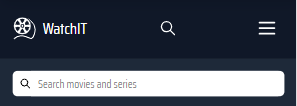
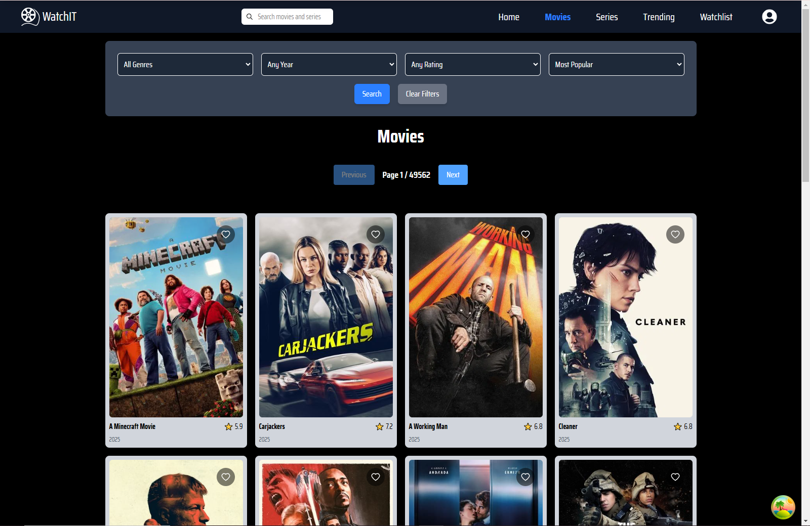
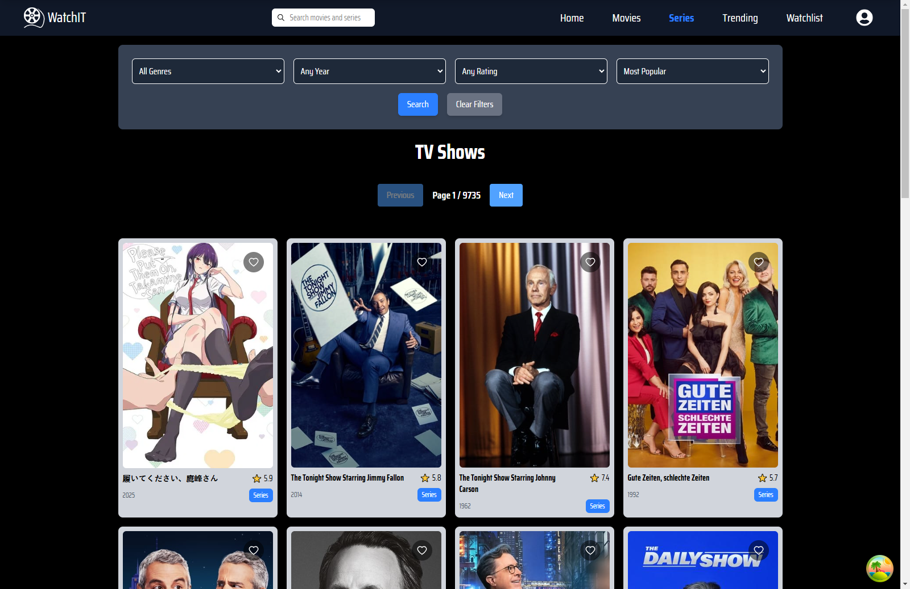
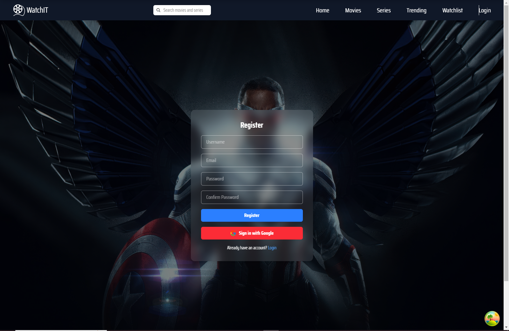
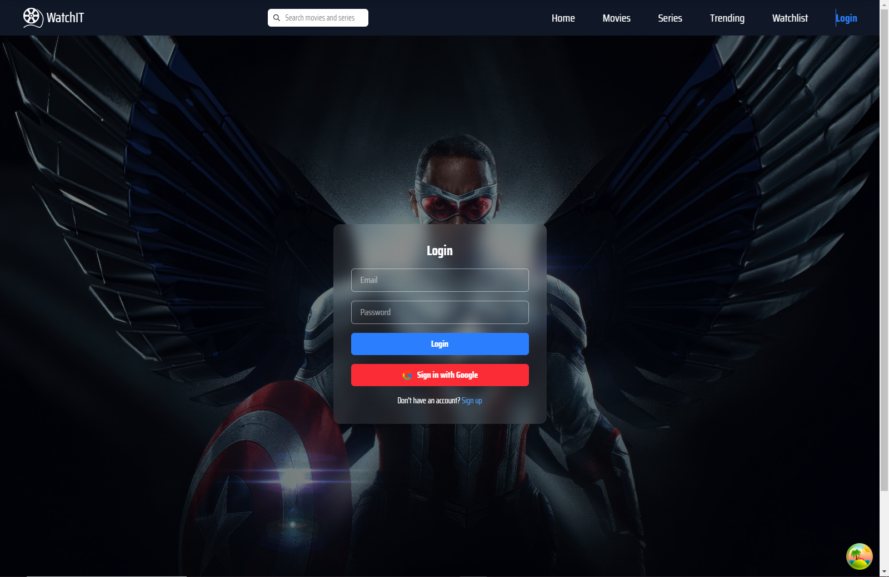
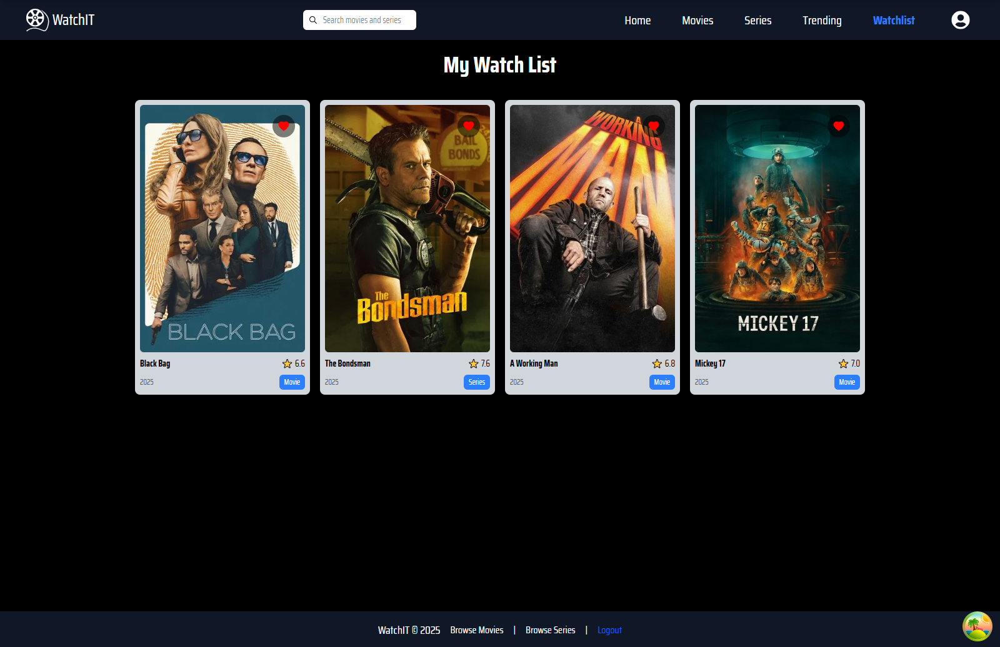

# 🎬 WatchIT

**WatchIT** is a responsive React-based web application that allows users to explore, search, and browse movies and TV shows using data from [The Movie Database (TMDb)](https://www.themoviedb.org/). It's fast, clean, and user-friendly.

---

## Features

### 1. Home Page

- Displays handpicked top-rated TV shows, top-rated movies, trending movies and TV Shows, and upcoming movies.

### 2. Search

- Real-time search for both movies and TV shows.
- Clean input design with search icon.
- Optimized for all screen sizes.

### 3. Movies Page

- Shows a paginated grid of popular movies.
- Responsive layout and smooth loading.

### 4. Series Page

- Lists trending or popular TV shows with visual cards.
- Fetches data dynamically via TMDb.

### 5. Popular Page

- Lets users explore trending content featured on the homepage.

### 6. Authentication

- Users can Register and login to add movies and TV shows to their personal watchlist.

### 7. Responsive Design

- Mobile-first layout.
- Uses the **Nunito** font for a modern, readable feel.
- Looks great on phones, tablets, and desktops.

---

## 8. Technologies Used

- **React** – Core UI framework.
- **React Router** – Page navigation and dynamic routing.
- **TMDb API** – Fetching movie and TV show data.
- **React Query** – Smart data fetching and caching.
- **Context API** – Global state management.
- **Tailwind CSS** – Utility-first styling.
- **Firebase** – Used for authentication.
- **Saira Condensed Font** – For clean and modern typography.

## 9. Project Structure

watchit/
├── public/ # Static files
├── src/
│ ├── components/ # Reusable UI parts like cards and search bar
│ ├── pages/ # Pages like Home, Movies, Series, Popular
│ ├── context/ # Global context (e.g., authentication)
│ ├── hooks/ # Custom hooks
│ ├── utils/ # Helper functions (e.g., date formatting)
│ ├── API/ # TMDb fetch functions
│ ├── AppRouter.js # App routing
│ ├── App.js # Main app logic
│ └── index.js # Entry point
├── .env # API keys
└── package.json # Dependencies and scripts

## Screenshots

### Search Bar

### Movies Page

### Series Page

### Register Page

### Login Page

### Watchlist Page

## 10. GitHub Repository

The source code for **WatchIT** is hosted on GitHub. You can access it, contribute to the project, and follow the development process through the repository link below.

👉 [GitHub Repository - WatchIT](https://github.com/JamesRTC/Final-ALX-Project.git)

Feel free to open issues, submit pull requests, or leave suggestions for improvements. All contributions are welcome!
